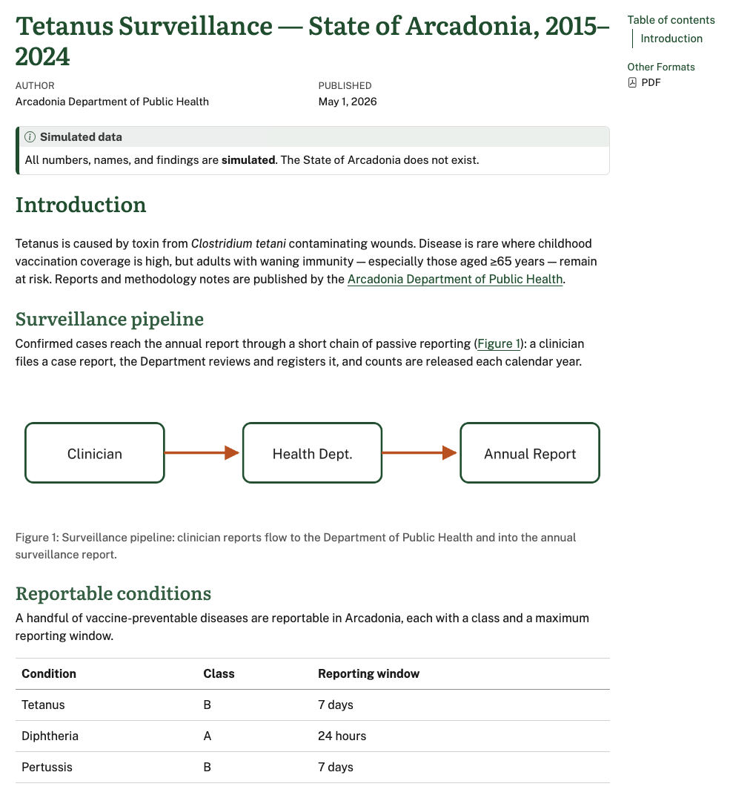
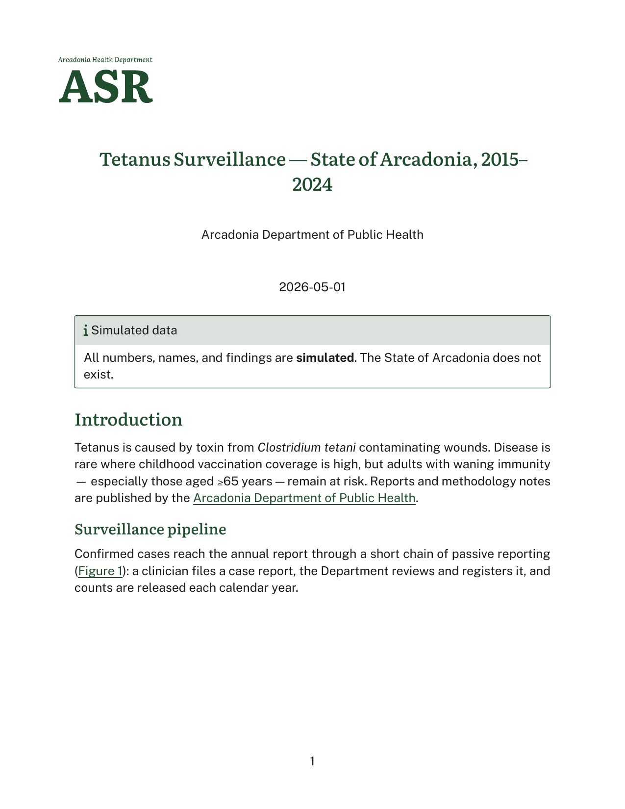

# brand-tweaks

A Quarto + brand document with a few style customizations layered on top of the default brand treatment. HTML adjustments live in an SCSS theme; Typst adjustments live in a raw `=typst` block. Both formats render from the same `.qmd`.

| HTML | PDF |
|------|-----|
|  |  |

## Files

| File | Role |
|------|------|
| `report.qmd` | Document source. Registers the SCSS theme, brand, and the typst include. |
| `custom.scss` | HTML tweaks — Bootstrap defaults + rules layered over the brand. |
| `typst-style.typ` | A raw `=typst` block included in the document body; carries `set`/`show` rules for the Typst output. |
| `_brand/_brand.yml` | Brand definition (colors, logo, fonts) — drives both formats. |

## What's customized beyond the brand

The brand integration handles the bulk of the styling automatically — colors, fonts, link treatment, callout coloring, the page-background logo on the PDF. Everything in this folder is small, targeted overrides on top of that:

### HTML — `custom.scss`

A two-section SCSS file uses Quarto/Bootstrap theme layering. `scss:defaults` sets Sass variables that Bootstrap and the brand SCSS read; `scss:rules` adds CSS rules at the end of the cascade.

```scss
/*-- scss:defaults --*/
$link-color: $brand-forest;

/*-- scss:rules --*/
h2 {
  border: none;
}
```

Wired up in the qmd via `theme: [custom.scss, brand]`. The order matters because `theme:` items are layered in reverse for `scss:defaults` — listing `custom.scss` first puts its assignments at the end of the defaults cascade, after brand has defined `$brand-forest`. That lets `custom.scss` reference brand variables and override brand `!default`s in the same pass.

### Typst — `typst-style.typ`

A small raw Typst block, included into the document body with ``:

````typst
```{=typst}
#show link: set text(fill: brand-color.forest)
#show ref: set text(fill: brand-color.forest)
#show ref: it => underline(it)
#show heading: set block(above: 1.5em, below: 1em)
```
````

Because the include lands in the body, the brand variables (`brand-color`, `brand-logo`, etc.) are already in scope. The rules here recolor links/refs to the brand forest, underline cross-references, and add a touch of breathing room around headings.

## Render

```bash
quarto render report.qmd               # both HTML and PDF
quarto render report.qmd --to typst    # PDF only
quarto render report.qmd --to html     # HTML only
```
