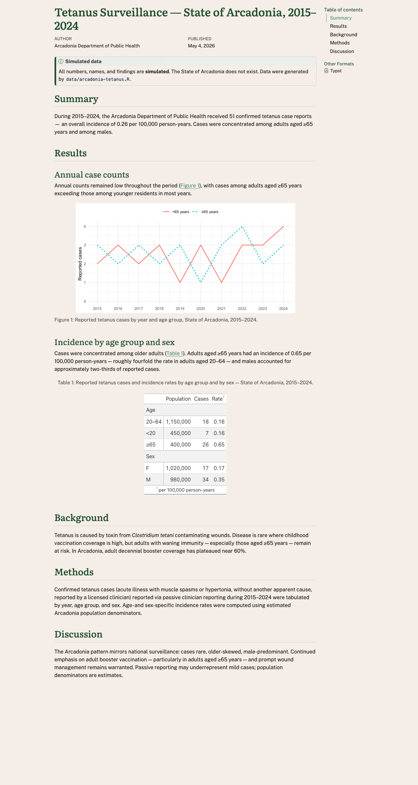

## Hello, I'm Charlotte Wickham

:::: columns
::: {.column width="60%"}

Developer Advocate  
{height="1em" style="vertical-align: middle;" fig-alt="Quarto"} @ {height="1em" style="vertical-align: middle;" fig-alt="Posit"}  

  

 [cvwickham](https://www.linkedin.com/in/cvwickham/)  
 [cwickham](https://github.com/cwickham)  
 [charlotte.wickham@posit.co](mailto:charlotte.wickham@posit.co)  
:::
::: {.column width="40%"}

:::
::::

::: footer
Demo code: <https://github.com/cwickham/accessible-branded-documents>
::: 

## Motivation {.hidden-title}

:::: {.columns}
::: {.column width="50%"}
Accessible   
[Reach]{style="font-size: 3em;"}

Legal requirements: [Section 508](https://www.section508.gov), [ADA Title II](https://www.ada.gov/resources/2024-03-08-web-rule/), [Web Accessibility Directive](https://digital-strategy.ec.europa.eu/en/policies/web-accessibility), [European Accessibility Act](https://ec.europa.eu/social/main.jsp?catId=1202)

Technical standards: [WCAG 2.0 AA](https://www.w3.org/TR/WCAG20/), [WCAG 2.1 AA](https://www.w3.org/TR/WCAG21/), [PDF UA-1](https://pdfa.org/resource/iso-14289-pdfua/)
:::

::: {.column width="50%"}
On-brand   
[Trust]{style="font-size: 3em;"}

Fonts   
Logos  
Colors  
Tone  
:::
::::

# Demo {.demo}

Start with `01-demo.qmd`

1. Add brand 
<!-- 10mins -->

2. Check accessibility
<!-- 5mins -->

3. Customize appearance 
<!-- 10mins -->

What about code? Later...

::: footer
Demo code: <https://github.com/cwickham/accessible-branded-documents>
::: 

## Add a brand  {.demo}

From an external repository:

```{.bash}
quarto use brand cwickham/arcadonia-brand
```

**Quarto: Preview** (HTML)

**Quarto: Preview Format...** (Typst (PDF))

Applies typography, colors, and logo (`typst` only)

Update? Run `quarto use brand` again.

## Brand components {.demo}

[`cwickham/arcadonia-brand`](https://github.com/cwickham/arcadonia-brand)

```{.yaml filename="_brand.yml"}
# Arcadonia Health Department brand
# A fictional public-health agency

meta:
  name: Arcadonia Health Department
  link: https://example.org/arcadonia-health

logo:
  images:
    seal:
      path: images/ahd-seal.svg
      alt: Arcadonia Health Department seal
    wordmark:
      path: images/asr-wordmark.svg
      alt: Arcadonia Health Department Arcadonia Surveillance Reports
  small: wordmark
  medium: wordmark
  large: wordmark

color:
  palette:
    forest: "#1f4d2e"
    forest-dark: "#0f2e1a"
    forest-light: "#5B9573"
    cream: "#f5eee8"
    ink: "#1a1a1a"
    rust: "#b8511f"
  background: cream
  foreground: ink
  primary: forest
  
typography:
  fonts:
    - family: Literata
      source: google
      weight: [400, 500, 700]
    - family: Public Sans
      source: google
      weight: [400, 700]
  base:
    family: Public Sans
    size: 12pt
  headings:
    family: Literata
    weight: 500
    color: primary
  link:
    color: forest-light
    decoration: underline

defaults:
  bootstrap:
    defaults:
      callout-color-note: $brand-forest
```

## Check accessibility: HTML

To see results in the document:
```{.yaml filename="01-demo.qmd"}
---
format:
  html:
    axe:
      output: document
---
```

::: callout-tip
Remember to remove `axe` before publishing!
:::

Uses [`axe-core`](https://github.com/dequelabs/axe-core) to check [WCAG 2.0 Level A & AA](https://github.com/dequelabs/axe-core/blob/develop/doc/rule-descriptions.md#wcag-20-level-a--aa-rules), [WCAG 2.1 Level A & AA](https://github.com/dequelabs/axe-core/blob/develop/doc/rule-descriptions.md#wcag-21-level-a--aa-rules) & [Best Practices](https://github.com/dequelabs/axe-core/blob/develop/doc/rule-descriptions.md#best-practices-rules)

## Check accessibility: Typst (PDF)

```{.yaml filename="01-demo.qmd"}
---
format:
  typst:
    pdf-standard: ua-1
---
```

Checks against PDF/UA-1:

* Within Typst
* On resulting PDF with [veraPDF](https://verapdf.org/), e.g. against [PDF/UA-1 ruleset](https://github.com/veraPDF/veraPDF-validation-profiles/blob/integration/PDF_UA/PDFUA-1.xml)

```{.bash filename="Terminal"}
quarto install verapdf
```

## Brand tweaks

Fix upstream in `cwickham/arcadonia-brand`:

```{.yaml filename="_brand.yml"}
typography:
  link:
    color: forest
```

Override in document options (or `_quarto.yml`):

```{.yaml filename="report.qmd"}
---
linkcolor: "#1f4d2e"
---
```

## Brand tweaks: CSS/SCSS for HTML

```{.yaml filename="examples/brand-tweaks/report.qmd"}
---
format:
  html:
    theme: [custom.scss, brand]
---
```

```{.scss filename="examples/brand-tweaks/custom.scss"}

```

## Brand tweaks: Typst rules

````{.yaml filename="examples/brand-tweaks/report.qmd"}
{}
````

````{.typst filename="examples/brand-tweaks/typst-style.md"}

````

## Brand tweaks: Partials

```{.yaml filename="examples/partials/report.qmd"}
---
format:
  typst:
    template-partials:
      - partials/typst-template.typ
      - partials/page.typ
      - partials/typst-show.typ
---
```

{fig-alt="Preview of PDF output showing a header with the Arcadonia Health Department seal and report title, and a footer with page number and report generation date."}

# Code Outputs

`02-with-code.qmd` a report with a `ggplot2` plot and `gt` table.

{fig-alt="Preview of code outputs showing a ggplot2 plot and a gt table."}

**Problem:** code outputs don't automatically use brand fonts or colors.

## Access brand via brand.yml package

Access brand in R:

```{.r}
library(brand.yml)
brand <- read_brand_yml()
brand
```
 
```{.r} 
base_family <- brand$typography$base$family
ink <- brand$color$foreground
paper <- brand$color$background
```

## Apply brand using package specific functions

Apply brand depending on packages you are using: 
```{.r}
# ggplot2 
... +
  theme_minimal(
    base_size = 12,
    base_family = base_family,
    ink = ink,
    paper = paper
  ) 
```

  
```{.r}
# gt 
... |>
  theme_brand_gt() |> # helper from `brand.yml` package
  opt_table_font(base_family, weight = "regular", add = FALSE) 
```

# Accessibility in practice

{fig-alt="Screenshot of a gt table with an accessibility violation highlighted by axe-core."}

## Authoring accessible documents

Authoring in `.qmd` naturally encourages:

* Using semantic structure (but don't skip heading levels) 
* A reading order 

Accessibility checks will catch some problems:

* Always set alternative text (`fig-alt`)
* Contrast of text and background in `format: html`

## Automatic checks aren't enough

* Is your alt text meaningful?
* Does the PDF tagging structure reflect logical structure?
* Are charts readable under color-vision deficiencies?
* Are tables coherent under cell-by-cell navigation?  
* Can a real person who relies on assistive tech actually use this?  

## Accessibility is a shared responsibility

Imagine a reader reporting an issue with a table in your PDF when using VoiceOver in Adobe Acrobat Reader.

The "fix" might live in: 
Your code, `gt`, `knitr`, Quarto, Pandoc, Typst, Adobe Acrobat Reader or "VoiceOver"

Expect:

* Some "work-arounds" for now...
* The landscape to improve over time, especially as more people test and report issues.

# Questions?

## Useful links

- Quarto brand documentation: <https://quarto.org/docs/authoring/brand/>
- Quarto HTML accessibility: <https://quarto.org/docs/output-formats/html-accessibility.html>
- PDF Standards and Accessibility - Typst: <https://quarto.org/docs/output-formats/typst/#pdf-standards-and-accessibility>
- Typst's accessibility guide: <https://typst.app/docs/guides/accessibility/>


## What about PDF via LaTeX?

`pdf-standard` also works for `pdf`:

```{.yaml}
format:
  pdf:
    pdf-standard: ua-2 # <- PDF/UA-2 
```

(But, no brand support for `pdf`...)
